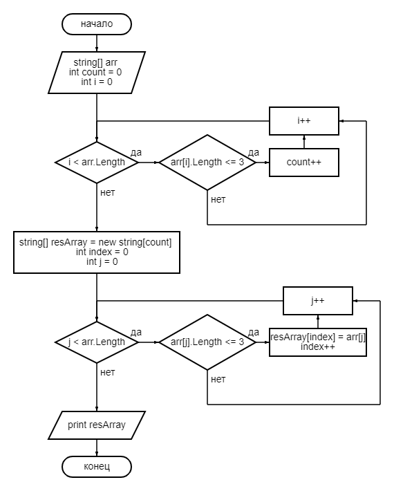

# FinalTest
>Задача: Написать программу, которая из имеющегося массива строк формирует новый массив из строк, длина которых меньше, либо равна 3 символам. Первоначальный массив можно ввести с клавиатуры, либо задать на старте выполнения алгоритма. При решении не рекомендуется пользоваться коллекциями, лучше обойтись исключительно массивами.

Три первоначальных массива для демонстрации работы программы заданы на старте ее выполнения: *linesArray1*, *linesArray2*, *linesArray3*.

Метод ***GetShortLines()*** принимает на вход массив из строк, формирует и возвращает массив из строк, длина которых меньше, либо равна 3 символам.

Переменная *count* - счетчик количества строк в исходном массиве, длина которых меньше, либо равна 3 символам. По окончании подсчета, реализованного через цикл *for*, она же становится значением длины нового создаваемого массива *resArray*.

Второй цикл *for* формирует новый массив, помещая на место *index* массива *resArray* j-й элемент исходного массива, если его длина меньше, либо равна 3 символам.

Блок-схема алгоритма представлена на рисунке:

